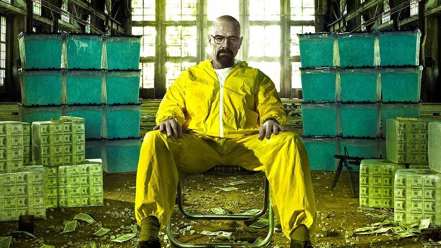
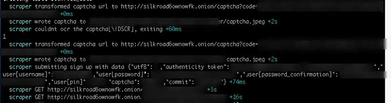

<div style="text-align:center;">
    
</div>

##Impetus
---

Last Friday, one of the top articles on [hacker news](http://news.ycombinator.com) was called [Breaking the Silk Road's Captcha](https://github.com/mieko/sr-captcha)

This sounded pretty cool to me, though not necessarily applicable because the current Silk Road 2.0 (I'll just be calling it SR from now on) isn't using anything nearly as sophisticated.

I thought it would be really interesting to scrape SR for, let's say a month or two. I could do cool stuff like make a stock ticker and display the values like `COK` `XTC` `LSD` etc.

##Disclaimer
---
**The following information is for educational purposes only, I have no affiliation with the Silk Road 2.0, nor have I ever purchased anything off the site. As far as I know, visiting the site and writing about it with no intention to buy (commit a crime) is perfectly legal.**

##Some implementation quirks
---
<div style="text-align:center;">
    
</div>

<br/>
**Before we begin:** I only wanted to spend an hour or two doing this. I was late for a dinner and wanted it to run overnight while I was sleeping. If you are looking to build a robust system, you should consider a different solution.

**Captcha**
> Simply download the captcha, run it through some opencv transforms, then feed it to tesseract. If it doesn't work, just keep on trying until we can get a relatively easy one. I think my sucess rate was >90% with some very tranforms using opencv.

**Connecting through tor**
> The SR site is an [anonymous hidden service](http://en.wikipedia.org/wiki/.onion) reachable only through the tor network. You run the tor client daemon on your machine, then use it as a SOCKS5 proxy.

> This has some complications, because dns requests also have to go through tor.

> The quick and dirty solution is to just spawn the scraper through [torsocks](https://gitweb.torproject.org/torsocks.git) which wraps all the net requests from my scraper.

**Automatic logouts/timeouts**
> The SR site seems to be very eager to automatically log out users. When logged out, I simply create a new user. When I am back on the site, I make sure to traverse to the last known point from the root node of our crawl tree. This is to avoid detection.

**The nature of web crawling through tor:**
> Crawling through tor already obfuscates your identity to a certain degree, so we don't really have to do anything other than cycling `User-Agent` strings to look different from any other client.


##Findings
---
Alright enough technical details, let's see what useful information we can get out of this.

Knowing very little about recreational drug use, I visited the [National Institute of Drug Abuse's website](http://www.drugabuse.gov/drugs-abuse/commonly-abused-drugs/commonly-abused-drugs-chart) which conveniently provided the names of, what the US considers, to be the most widely used drugs.

I thought, if I know them, they must be a big deal right?! I guess so. Here are the drugs I picked out:

- [Cocaine](http://en.wikipedia.org/wiki/Cocaine)
- [Heroin](http://en.wikipedia.org/wiki/Heroin)
- [Opium](http://en.wikipedia.org/wiki/Opium)
- [Amphetamine](http://en.wikipedia.org/wiki/Amphetamine)
- [Mdma](http://en.wikipedia.org/wiki/MDMA)
- [Ketamine](http://en.wikipedia.org/wiki/Ketamine)
- [Mescaline](http://en.wikipedia.org/wiki/Mescaline)
- [LSD](http://en.wikipedia.org/wiki/Lysergic_acid_diethylamide)
- [Weed](http://en.wikipedia.org/wiki/Cannabis)

###Total number of listings
---
<object type="image/svg+xml" data="total_listings_by_drug.svg">Your browser does not support SVG</object>

```md
Sorted by number of listings
----------------------------
MDMA        1321
Weed        761
LSD         523
Cocaine     475
Amphetamine 215
Heroin      150
Ketamine    67
Opium       53
Mescaline   20
Total       3585
```
`weed is simply marijuana that is smoked, not any other derivative such as hash`

To put things in perspective, at the moment of writing this SR has approximately 13,000 listings for drugs. Just a guess, but it looks like prescription drugs account for a large portion of SR drug listings.

Nothing much to say here, other than the fact that MDMA seems to have the most listings.

###Highest number of ratings
---
<div class="row">
    <div class="col-lg-6">
        <object type="image/svg+xml" data="ratings_by_drug.svg">Your browser does not support SVG</object>
    </div>
    <div class="col-lg-6">
        <object type="image/svg+xml" data="ratings_by_drug_div.svg">Your browser does not support SVG</object>
    </div>
</div>

Just like buying off Amazon, users can review the specific product. SR gives a rating from 1-5 stars and the total number of reviews per product listing.

The average number of ratings per product as shown here seem to be rather uniform, there is on average 29 reviews per product.

```md
MDMA           33822    25
Weed           28213    37
LSD            12122    23
Cocaine        16591    34
Amphetamine    6251     29
Heroin         3132     20
Ketamine       1504     22
Opium          1256     23
Mescaline      62       3

Total          102953

```

###Top 100 Most Reviewed Items
---
MDMA          48
Weed          22
LSD           10
Cocaine       9
Amphetamine   7
Ketamine      1
Opium         1
Mescaline     1
Heroin        1

<div class="row">
    <div class="col-lg-6">
        <object type="image/svg+xml" data="top100_prices.svg">Your browser does not support SVG</object>
    </div>
    <div class="col-lg-6">
        <object type="image/svg+xml" data="top100_prices_removed_outliers.svg">Your browser does not support SVG</object>
    </div>
</div>

In case you are wondering, there were some outliers:
- One had **100g of MDMA for $1510.77**. **It had 392 ratings.**
- Another was selling **100g of mdma for $1186** and **50g for $659**. They had **293 ratings** and **279 ratings* respectively.
- The other was for **1/4lb of bulk medical marijuana for $619.10**. **It had 378 ratings.**

I somehow doubt this guy has sold half a million dollars worth of MDMA at $1.5k a pop in such a huge quantity, but the price seems to be in line with other sellers for an equivalent amount. **I'm not entirely sure what the rules are regarding who can give feedback, but there seem to be people buying huge quantites if a user must buy a product to be able to review it. I have never purchased anything from the site, and I wasn't presented with any choices to review an item.**

If only people who purchase the item can review it, then I am a bit less skeptical. I saw one canadian seller listing 1 kilo of MDMA for USD $8k with 1 review!

========================================================
####The average price of the top 100 items is `$129`
####The average price of the top 500 items is `$188`
####The average price of the top 1000 items is `$236`
`Prices are converted to USD at time of crawl using exchange rates from the coinbase api.`
###Countries
---
Sellers on SR can specify where they ship from and where they ship to.

<object type="image/svg+xml" data="sellers_by_country.svg">Your browser does not support SVG</object>

```md
isocode number of listings
--------------------------------
us   93
au   45
gb   40
de   39
nl   35
ca   32
se   10
cn   6
za   4
be   4
it   2
es   2
nz   2
no   2
ie   2
pl   2
dk   2
sk   1
cz   1
fi   1
fr   1
ch   1
at   1
in   1

```
###Observations
---
####Total Sales Volume
>If, indeed every sale can map to a transaction, some vendors are doing huge amounts of business through mail order drugs. While the number is small, **if we sum up all the product reviews x product prices, we get a huge number of `USD $20,668,330.05`.**

>REMEMBER! This is on Silk Road 2.0 with a very small subset of their entire inventory.

```sql
sqlite> SELECT SUM(review_count * price_usd) FROM silkroad_data WHERE review_count > 0;
20668330.0569627
sqlite> SELECT COUNT(*) FROM silkroad_data;
3579
```

####Comparing to Agora
>The agora marketplace seems to have more or less the same number of listings. It would be interesting to see whether or not the sellers are the same or different between the sites.

####Junk listings
>SR has quite a lot of junk listings, there are all sorts of listings unrelated to the product category. I had to filter out quite a lot of listings which deviated too far from the mean price per unit volume. The Agora Marketplace seems to be a bit better curated and moderated. I think suspect that it has more **real** inventory than SR.

###Closing
---
####I won't tell you that I know what I'm doing
>This is simply a collection of observations from someone who knows pretty much nothing about the drug world. It is probably among the longest articles I have ever written, any suggestions with regard to writing would be greatly appreciated. It must have taken me at least 3 times the amount of time to write this article versus getting all the data!

####Need more data
>I've set up a cron-type job to crawl SR daily and crunch some numbers. It will be interesting to see how things change over time, though a month may not be enough time to see any significant shifts. I will release the source code for the crawler when I am done, with the SR specific portions removed if anyone is interested. I'll also set something up to gather data from Agora.

####This was a bit much for me
>It was really creepy looking through all those drug listings, with rocks of all sorts of shapes and colors. I spent way too much time writing this article, hope someone finds it educational.


###To be continued ...
---
>Part 1 gave us an overall, albeit superficial view of the numbers behind SR 2.0.

>Part 2 will focus on pricing, trends and predictions.

>In the last part of the series, I will report on changes over time.
