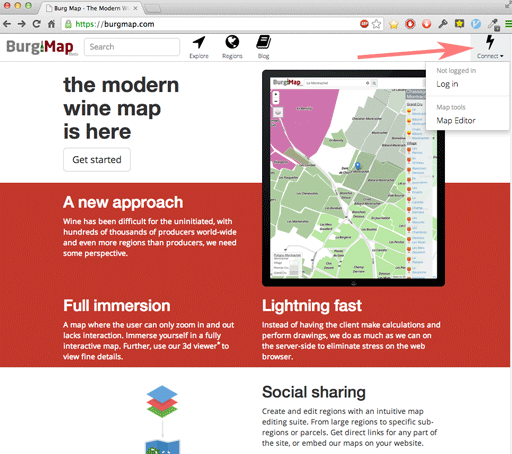
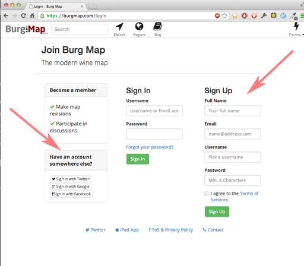
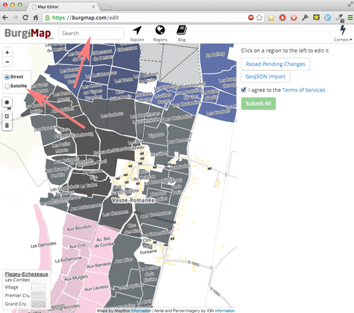
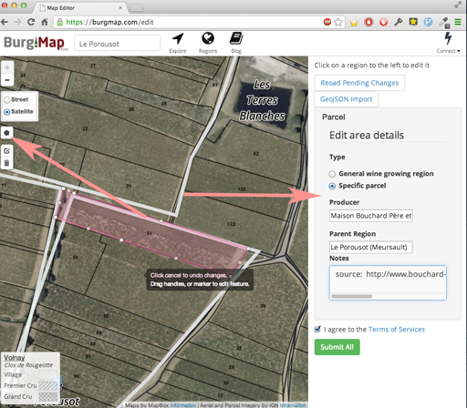
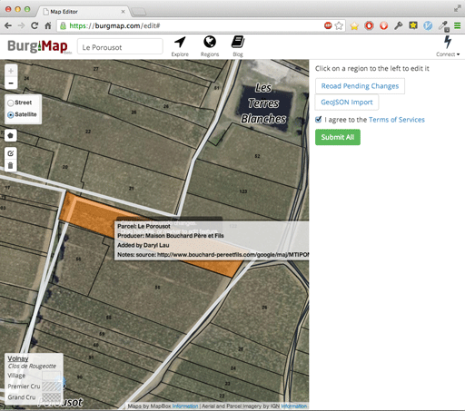
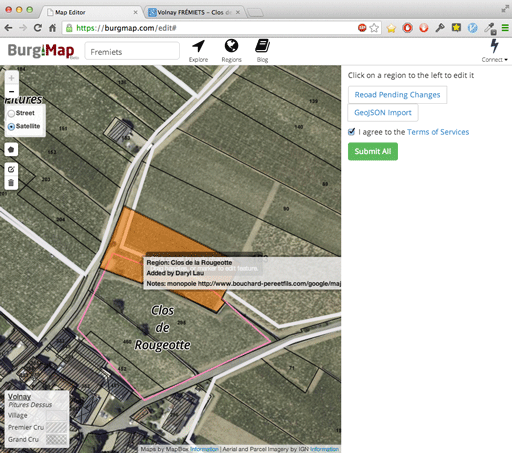

Greetings to the ever growing readers! Today I would like to introduce the Burg Map Editor that went live yesterday.

----

####A few notes to the foreign audience.

>Pour mes amis francophones, je suis desolé, maintenant je n ai pas les ressources de faire une traduction en Français. Je le ferai quand je réaliserais le website. Mon français n est pas très bon, donc il est possible qu'il soit difficile. Remercions de votre patience.

>中國台灣同志好。現在這個Website Burg Map只有英文的版本。等大部份英文Website做好的時候 就開始翻譯到中文傳統。 完成後，簡化中文不會太難。 謝謝寧的耐心

You may have noticed a new addition to the site, a little lightning bolt on the right side. This provides the powerful user functionality

    

To start, log in either by creating an account or using a pre-existing identity. I myself use my Google account, I have enough passwords as is!

    

Once you're logged in, click on the lightning bolt again, and it should have an option to edit now!

    

Now you can search for something to get your bearings, then add it!
Bouchard Père & Fils have documented their vineyards quite well, so let's use one of those as an example

 Here I am adding their Meursault "Le Porusot" vineyard, the kmz file is here:
`http://www.bouchard-pereetfils.com/google/maj/MTIPOM_01_B1ST_G_ES.kmz`

    
    

It is as simple as drawing a polygon and editing the details. Currently parcels and general wine growing regions are supported.
When you're done, click submit and it should show your change, which is pending for review. All submissions are screened by a human (me right now!) and won't be added to the main map until they are processed.

>##Oops!!

I was browsing around on the Bouchard Père &fils website, and noticed that there was a sub-region missing on the map! Oh no!

After further research, it would seem that there are two Clos de la Rougeotte appellations in Volnay:

- One Volnay-Fremiets-Clos de la Rougeotte
- Another that is simple Volnay-Clos de la Rougeotte, the one inside of Fremiets being a monopole for Bouchard.

Let's fix that and add a region inside of Fremiets, accordingly:

    

Done! Hope that was painless. More coming soon, keep one eye open! I'm still new to this blogging thing, hope to make regular posts!
