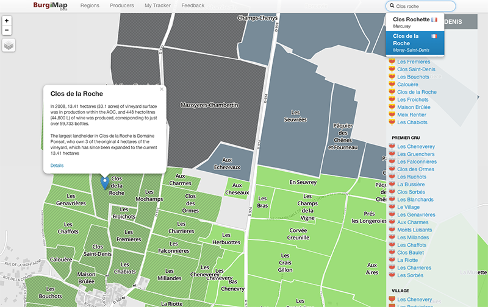

Today we would like to introduce Burg Map.

----

##Burgundy first
Get really good at Burgundy first. A world map can support all the worlds' regions eventually.

##Fully interactive map
Approach the vast world of wine, visually, through a fully interactive experience, any region can be clicked for additional information.

Regions are divided into their natural organization.

For example, Burgundy with `Grand Cru` `Premier Cru` and `Village` designations or Bordeaux wines with their `First Growths (Premiers Crus)` `Second Growths (Deuxièmes Crus)` `Third Growths (Troisièmes Crus)` `Fourth Growths (Quatrièmes Crus)` `Fifth Growths (Cinquièmes Crus)` designations.

##Search functionality
Searching for a region name brings you directly to the information

## Community based wiki-style articles
For more information, a wiki style article system allows users to drill down to the specifics about each wine growing region. We are using Wikipedia articles as a base. All articles are licensed under the [Creative Commons Attribution 3.0 Unported License](http://creativecommons.org/licenses/by/3.0/)

This community-based system is integral to keeping up with the times--so to say. More on this at the end of the post.

## Edit articles easily in markdown syntax

## Imagery with [MapBox Satellite](http://mapbox.com)

## A lot more to do
This post outlines some basic functionality that is included in our first public release. There are, however, many must-have features before making this public and available.

###Parcel Editor:
Currently, there is support of region-level editing. Down to certain administrative levels, the information is freely available. Unfortunately, at the commune level and more certainly at the parcel level, this does not seem to be the case. This is further complicated by fact that we will limit the satellite zoom level to 12 in our editor because of issues with derived works, you can read more about that [here](http://www.mapbox.com/tos/).

Regarding tagging a parcel to a specific producer - The solution, at the current time, is to map out every parcel for the user, so they can click on the parcel and assign
###Time based data:
Things change, plots of land switch hands, regions are renamed, producers retire and their children take over. A recent example would be the Clos Frantin -> Clos Eugenie. This is one of the biggest sources of confusion when it comes to French wines. One of our goals is to demystify these transitions
###Simplicity
While the user can drill down to the fine details about who owns what parcel of land, the bottom line is that we're all very busy. While geeking out over these things can be interesting, most of us would rather be partaking in activities such as eating and drinking!
###Focused on facts
No scores? This is a bit up in the air, but in this day and age, scores seem to be doing more harm than good. Let's revisit how we discover wine.
###Premium, Freemium?
The map hosting as well as systems to serve up this resource may get very costly. Rest assured, we will never limit access to information through some sort of premium model.

At least for now, the only avenue for any revenue is from the iPad application. It will provide 100% free access to the maps when online, but users will have to purchase a package to download and browse without an Internet connection. I really can't think of any other non-intrusive way to go about this. Of course, there is the traditional method of advertising, but that can trigger a slippery slope, as we strive to be as unbiased as possible.
###Few more things
I haven't touched on producers, as well as a few more topics. Watch for a subsequent blog post outlining those.

Please contact me with any suggestions or bugs!

## Many thanks to...
[Leaflet](http://leafletjs.com) for their front-end mapping library

[Mapbox](http://mapbox.com) for their map hosting, especially their amazing aerial imagery

[Wikipedia](http://wikipedia.org) and its contributors for their permissive licensing policy

[Bootstrap](http://twitter.github.io/bootstrap) for being awesome

[Epiceditor](http://epiceditor.com/) for the markdown editor

And countless others that I have surely missed
